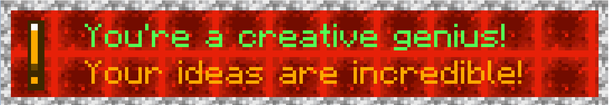
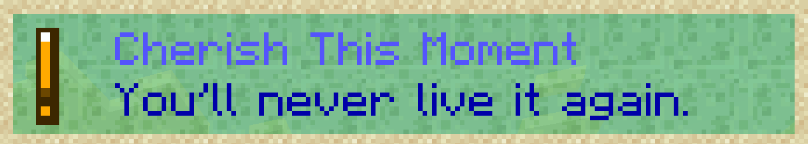
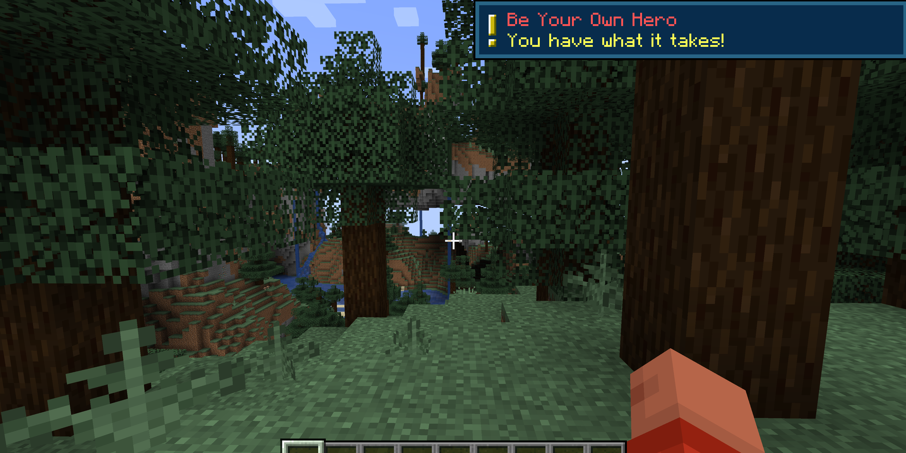

  

**Gentle Reminders** is a mod that sends mindful messages to the player every so often based on a customizable config file.

## Features  
- [X] Generates a config file on client startup if one doesn't exist
- [X] Checks version of config file to guarantee latest message updates
- [X] Client reads from config file to get settings
- [X] On world join, sends an initial message if the mod is enabled
- [X] Every X ticks, based on config, sends a mindful message
- [X] When all messages are sent (in a random order with no repeats), resets the list and starts over
- [ ] Add a drastically large amount of messages  
  - Current # of simple messages: **34**
  - Current # of unique messages: **62**
- [X] Improve config understandability (see [Config Guide](#config-guide))
- [X] Add tons of commands for customization (see [Command Guide](#command-guide))
- [X] Can choose a Display Style, currently the default Minecraft toast system or by a chat message
- [X] Can choose some custom toasts via Display Style, currently light or dark
- [X] More custom toast display styles
  - [ ] Allow for non-vanilla blocks to be used as custom bg/border on toasts
- [ ] Custom message icons (instead of an exclamation point)
- [ ] Custom message noises?
- [ ] Make some super cool GUI to edit how the custom toasts look

## Message Examples
**A Simple Message, using the `"default"` display style**

  
**A Unique Message, using the `"chat"` display style**


**A Unique Message, using the `"light"` display style**


**A Unique Message, using the `"dark"` display style**


**A Unique Message, using the `"custom"` display style; blackstone background, and resin brick border**


**A Unique Message, using the `"custom"` display style; dark oak planks background, and amethyst block border**


**A Unique Message, using the `"custom"` display style; redstone block background, diorite border**


**A Unique Message, using the `"custom"` display style; slime block background, sand border**


**A Unique Message in-game, using the `"default"` display style**


## Config Guide
The config file can be found at `config/gentlereminders-config.toml` (after running the game once), which can be edited with any text editor. You can change the values for the interval between messages, add or remove messages, and enable or disable the mod.   
  
Adding messages should be done in the following format:
```js
  {id=#, title="String", message="String", enabled=boolean, titleColor="String", messageColor="String"},
```
- `id` is a whole number that should be unique between messages  
- `title` is the title of the message that will be displayed at the top of the toast  
  - **Important Note**: This title can not include a comma (`,`) or the config file will break
- `message` is the message that will be displayed in the body of the toast 
  - **Important Note**: This message can not include a comma (`,`) or the config file will break
- `enabled` is a boolean that determines if the message can be sent - if you're setting to false anyway, you can also just remove the message unless you think you'll want to re-enable it later
- `titleColor` is a string that represents the color of the title text, which can be any of the colors below:
- `messageColor` is a string that represents the color of the message text, which can be any of the colors below:
```js
 "black", "dark_blue", "dark_green", "dark_aqua", "dark_red", "dark_purple", "gold", "gray", "dark_gray", "blue", "green", "aqua", "red", "light_purple", "yellow", "white"
```

## Command Guide
Required arguments are surrounded by `[brackets]`  

### `/gentlereminders` and `/gentlereminders help`
- Displays the help message

### `/gentlereminders get TimeRemaining`
- Displays the time remaining until the next message is sent

### `/gentlereminders get ConfigPath`
- Displays the path to the config file

### `/gentlereminders get ConfigVersion`
- Displays the version of the config file

### `/gentlereminders get DisplayStyle`
- Displays the current display style

### `/gentlereminders get TicksBetweenMessages`
- Displays the number of ticks between messages, as well as minutes and seconds

### `/gentlereminders get Messages [pageNumber]`
- Displays 5 messages at a time, starting at the page number specified

### `/gentleReminders set DisplayStyle [style]`
- Sets the display style to either `"default"`, `"light"`, `"dark"`, or `"chat"` (use the below command for `custom`)

### `/gentleReminders set CustomDisplayStyle [bgTexture] [borderTexture] [enableIcon]`
- Sets the display style to `custom`, then sets the background and border textures, as well as whether or not to include the exclamation mark

### `/gentlereminders set TicksBetweenMessages [ticks]`
- Sets the number of ticks between messages

### `/gentlereminders set Message [id] [title] [message] [enabled] [titleColor] [messageColor]`
- Overwrites the title, message, enabled status, and colors of a message by ID

### `/gentlereminders add Message [title] [message] [enabled] [titleColor] [messageColor]`
- Adds a new message with the specified title, message, enabled status, and colors

### `/gentlereminders remove Message [id]`
- Removes a message by ID

### `/gentlereminders enable GentleReminders`
- Enables the mod

### `/gentlereminders enable Message [id]`
- Enables a message by ID

### `/gentlereminders disable GentleReminders`
- Disables the mod

### `/gentlereminders disable Message [id]`
- Disables a message by ID
